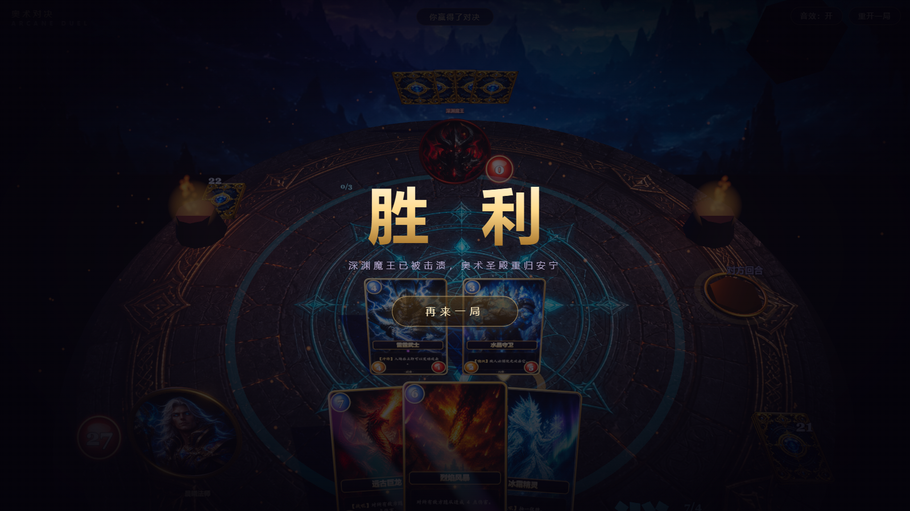

# 奥术对决 · Arcane Duel

一个用 Three.js 构建的 3D 奇幻风格 TCG 卡牌。一局 14 层地图，节点上进入战斗、事件、商店、篝火或宝藏。战斗规则在 `Game`，画面在 `Director`，长线进度在 `RunController`。

## 快速开始

```bash
npm install
npm run dev        # 打开 http://localhost:5173
npm run build      # 产物输出到 dist/
```

## 玩法

战斗是精简 TCG 规则，叠在 14 层远征上。

- 远征开局 40 血、90 金。从三份初始卡包里选一套（余烬先锋 / 晶壁守望 / 裂隙织法），核心牌固定，再从主题池抽几张，每局 14 张起手不会完全一样。打进 Boss 并获胜才算通关。
- 战斗双方英雄谁先到 0 谁输。同时击倒时玩家胜。
- 每回合法力 +1（上限 10），回合开始回满并抽一张。玩家先手。
- 随从入场当回合不能攻击，除非带冲锋。场上有嘲讽时，随从攻击必须先打嘲讽。法术和敌方预兆打脸不受嘲讽限制。
- 牌库抽空后疲劳伤害递增。战场最多 6 个随从，手牌最多 10 张，超出焚毁。
- 敌方回合先结算预兆，再由 `pseudoai/brain.js` 出牌和攻击。本地 LLM 只负责台词，不选牌。

## 卡牌一览

图鉴在 `src/game/cards.js`。开局卡包在 `src/run/packs.js`。

## 技术架构

```
src/
├── config.js            # 卡尺寸、布局、规则数值、配色
├── main.js              # 启动、主循环、window.__tcg / __run
├── input.js             # 战斗指针：拖拽、瞄准、空格结束回合
├── game/
│   ├── cards.js         # 图鉴。加新卡从这里开始
│   ├── game.js          # 战斗规则。只改数据并 await this.fx
│   ├── intent.js        # 敌方预兆
│   └── snapshot.js      # 局面快照，给调试和对照脚本
├── run/
│   ├── controller.js    # 远征循环：地图 → 节点 → 战斗/事件/店
│   ├── state.js         # createRun、起手牌库、grantRelic
│   ├── map.js           # 14 层 Act 1
│   ├── encounters.js    # 遭遇
│   ├── events.js        # 事件
│   ├── shop.js / rewards.js / relics.js
├── pseudoai/
│   ├── brain.js         # 敌方出牌和攻击（不读预兆，不用 LLM）
│   ├── tactics.js       # 选牌分数，并给台词暴露下一步打算
│   ├── voice.js         # 提示词：说人话，不硬切半句
│   └── banter.js        # 台词。LLM 挂了就走本地句子
├── three/director.js    # fx 实现 + 玩家入口（canAct / busy）
├── ui/                  # 标题、地图、商店、HUD
├── audio/sfx.js
└── utils/rng.js         # mulberry32。run 与战斗洗牌共用一条流
```

改规则只动 `game/`。改远征只动 `run/`。改演出只动 `three/` 和 `ui/`。`npm test` 跑 `scripts/check-run-logic.mjs` 和 `scripts/check-combat-logic.mjs`。

## 二次开发指南

- **加一张新卡**：在 `src/game/cards.js` 的 `CARDS` 里加定义，原画放到 `public/assets/` 并在 `src/utils/assets.js` 的 `IMAGE_LIST` 登记，再放进遭遇牌库、商店池或 `STARTER_DECK`。现成关键字：`taunt` / `charge`。战吼：抽牌、AOE、打脸。法术：伤害、治疗、抽牌、AOE、加减攻、护甲。
- **加新机制**：在 `game.js` 的 `playCard` / `attack` / `startTurn` 加规则，再到 `director.js` 补一个 `fx` 方法。
- **调数值**：`src/config.js` 的 `rules`。远征金币和篝火也在这里。
- **调画面**：`config.js` 的 `layout`；镜头与后期在 `sceneSetup.js`。
- **换美术**：替换 `public/assets/` 下同名 PNG。卡面文字和边框是运行时画的。

## 调试接口

控制台可用 `window.__tcg`（也是自动化测试入口）：

```js
__tcg.state()                    // 完整局面快照（回合/血量/手牌/战场）
__tcg.play(0, { slot: 0 })       // 打出第 0 张手牌
__tcg.play(2, { target: 'ehero' }) // 指向性法术指定目标（'ehero'/'phero'/{side,i}）
__tcg.attack(0, 'ehero')         // 第 0 个随从攻击敌方英雄
__tcg.end()                      // 结束回合
__tcg.setHp('enemy', 5)          // 直接改英雄血量
__tcg.errors                     // 运行期 JS 错误收集（应恒为空）
```

URL 加 `?seed=12345` 可固定洗牌种子，复现同一局。

## 结算

击杀敌方英雄触发全屏结算与"再来一局"：



## 技术栈

- [three](https://threejs.org/)：渲染、Raycaster 交互、EffectComposer 后期（UnrealBloom + 自定义调色/暗角 Shader）
- [gsap](https://gsap.com/)：所有卡牌 / 镜头 / 特效动画的时序编排
- [vite](https://vitejs.dev/)：开发与构建
