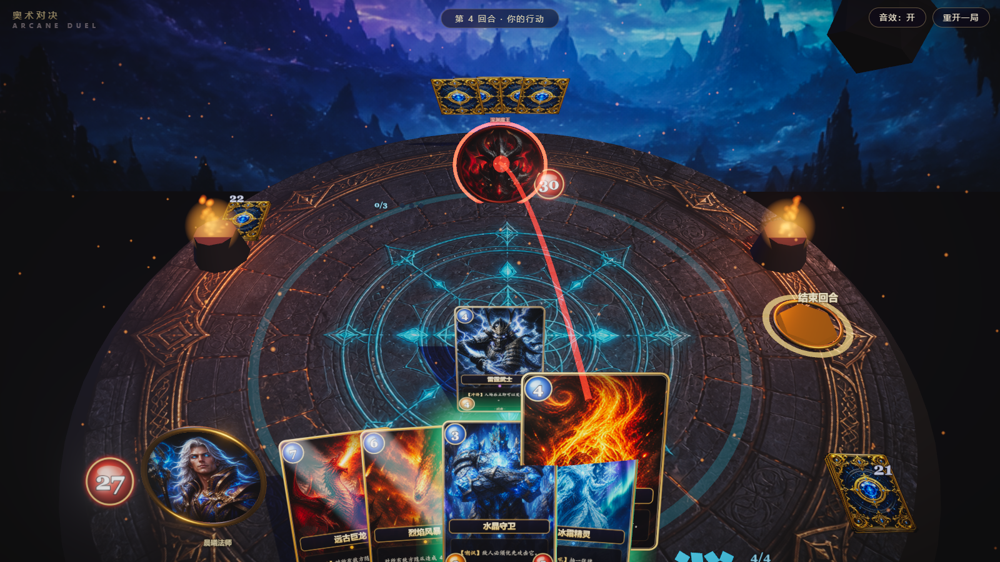

# 奥术对决 · Arcane Duel

一个用 **Three.js** 构建的 3D TCG 卡牌对战 Demo。重点在视觉表现：实体 3D 卡牌、自定义着色器、体积感光效、后期处理、程序化音效，规则层刻意保持精简

## 快速开始

```bash
npm install
npm run dev        # 打开 http://localhost:5173
npm run build      # 产物输出到 dist/
```

无需任何后端与外部服务，全部资产在 `public/assets/`（AI 生成的原画）与运行时程序化生成（辉光/噪声/UI 贴图、音效）。

## 玩法

经典 TCG 极简规则集（类炉石）：

- 双方英雄 30 血，谁先归零谁输。
- 每回合法力水晶 +1（上限 10），回合开始回满并抽一张牌。
- 随从入场有召唤失调（当回合不能攻击），除非带**冲锋**；场上有**嘲讽**随从时必须先攻击它。
- 随从互殴双方同时结算伤害；法术分指向性（火球/闪电/治疗）与无目标（AOE/抽牌）。
- 牌库抽干后疲劳伤害递增；战场上限 6 个随从，手牌上限 10 张（超出焚毁）。

### 操作

| 操作 | 方式 |
| --- | --- |
| 出随从 | 从手牌**拖拽**到战场（可插入任意空位） |
| 施放指向法术 | 按住法术卡，出现瞄准箭头后**指向目标**松开 |
| 施放无目标法术 | 把法术卡**拖到战场区域**松开 |
| 随从攻击 | 按住己方随从，**拖箭头指向**敌方随从或英雄 |
| 结束回合 | 点击右侧**金色符印**，或按**空格** |
| 取消操作 | 拖回手牌区 / 松开在无效位置 / 按 Esc |

绿色描边 = 本回合可出的牌 / 可攻击的随从；红色标记 = 合法攻击目标。



## 卡牌一览（13 种 / 30 张卡组）

| 卡牌 | 费用 | 属性 | 效果 |
| --- | --- | --- | --- |
| 烈焰小鬼 | 1 | 2/1 | — |
| 翡翠妖狼 | 2 | 3/2 | — |
| 水晶守卫 | 3 | 2/5 | 嘲讽 |
| 暗影刺客 | 3 | 4/2 | — |
| 雷霆武士 | 4 | 4/3 | 冲锋 |
| 冰霜精灵 | 4 | 3/4 | 战吼：抽 1 张牌 |
| 圣光骑士 | 5 | 5/5 | 嘲讽 |
| 远古巨龙 | 7 | 8/8 | 战吼：对敌方全体随从 2 伤（传说卡带流光箔面） |
| 闪电之矢 | 2 | 法术 | 对一个敌方角色 3 伤 |
| 治愈圣光 | 2 | 法术 | 治疗友方角色 5 点 |
| 奥术智慧 | 3 | 法术 | 抽 2 张牌 |
| 烈焰火球 | 4 | 法术 | 对一个敌方角色 6 伤 |
| 烈焰风暴 | 6 | 法术 | 对敌方全体随从 4 伤 |

## 技术架构

```
src/
├── config.js            # 全局配置：卡牌尺寸 / 布局坐标 / 规则数值 / 配色
├── main.js              # 启动入口、主循环、调试接口 window.__tcg
├── input.js             # 指针交互：悬停 / 拖拽 / 瞄准箭头 / 快捷键
├── game/
│   ├── cards.js         # ★ 卡牌图鉴 + 卡组配比（加新卡从这里开始）
│   ├── game.js          # ★ 规则引擎（唯一状态权威，视觉全部经 fx 注入）
│   └── ai.js            # 敌方 AI：贪心出牌 + 启发式选择攻击目标
├── three/
│   ├── sceneSetup.js    # 场景/相机/灯光/竞技场/背景/后期管线（Bloom + 调色）
│   ├── cardMaterial.js  # 卡面 ShaderMaterial：溶解 / 受击闪白 / 传说箔面 / 去饱和
│   ├── cardVisual.js    # 单张卡的 3D 实体：Canvas 绘制卡面、描边、状态环
│   ├── heroVisual.js    # 英雄头像、血量宝珠、法力水晶
│   ├── layout.js        # 手牌扇形 / 战场排布的变换计算
│   ├── director.js      # ★ 视觉总调度：实现 fx 接口，编排所有动画时序
│   ├── effects.js       # 战斗特效：飘字 / 弹道 / 闪电 / AOE / 治疗 / 死亡溶解
│   └── particles.js     # 轻量粒子系统（爆发 / 余烬 / 火盆）
├── ui/hud.js            # HTML 层：回合横幅 / Toast / 结算画面 / 加载页
├── audio/sfx.js         # Web Audio 程序化音效（无音频文件）
└── utils/               # 种子随机 / Canvas 贴图工具 / 资产加载
```

核心解耦：`game.js` 只改数据并 `await this.fx.xxx()`，`director.js` 实现全部 `fx` 视觉方法。**改规则不用碰渲染，改表现不用碰规则。**

## 二次开发指南

- **加一张新卡**：在 `src/game/cards.js` 的 `CARDS` 里加定义，把原画放到 `public/assets/art_<id>.png` 并在 `src/utils/assets.js` 的 `IMAGE_LIST` 登记，最后加进 `DECK_RECIPE`。现成可组合的能力：`taunt` / `charge` / 战吼（抽牌、AOE）/ 法术（伤害、治疗、抽牌、AOE）。
- **加新机制**：在 `game.js` 对应流程（`playCard` / `resolveAttack` / `startTurn`）加规则分支，再到 `director.js` / `effects.js` 补一个视觉方法即可。
- **调数值**：血量、法力上限、起手牌数等都在 `src/config.js` 的 `rules`。
- **调画面**：布局坐标（手牌高度、英雄位、出牌判定区）在 `config.js` 的 `layout`；镜头与后期（Bloom 强度、暗角、调色）在 `sceneSetup.js`。
- **换美术**：直接替换 `public/assets/` 下同名 PNG 即可，卡面文字与边框是运行时 Canvas 绘制的。

## 调试接口

控制台可用 `window.__tcg`（也是自动化测试入口）：

```js
__tcg.state()                    // 完整局面快照（回合/血量/手牌/战场）
__tcg.play(0, { slot: 0 })       // 打出第 0 张手牌
__tcg.play(2, { target: 'ehero' }) // 指向性法术指定目标（'ehero'/'phero'/{side,i}）
__tcg.attack(0, 'ehero')         // 第 0 个随从攻击敌方英雄
__tcg.end()                      // 结束回合
__tcg.setHp('enemy', 5)          // 直接改英雄血量
__tcg.errors                     // 运行期 JS 错误收集（应恒为空）
```

URL 加 `?seed=12345` 可固定洗牌种子，复现同一局。

## 结算

击杀敌方英雄触发全屏结算与"再来一局"：


## 技术栈

- [three](https://threejs.org/)：渲染、Raycaster 交互、EffectComposer 后期（UnrealBloom + 自定义调色/暗角 Shader）
- [gsap](https://gsap.com/)：所有卡牌 / 镜头 / 特效动画的时序编排
- [vite](https://vitejs.dev/)：开发与构建
- Web Audio API：全部音效为程序化合成，零音频资产
